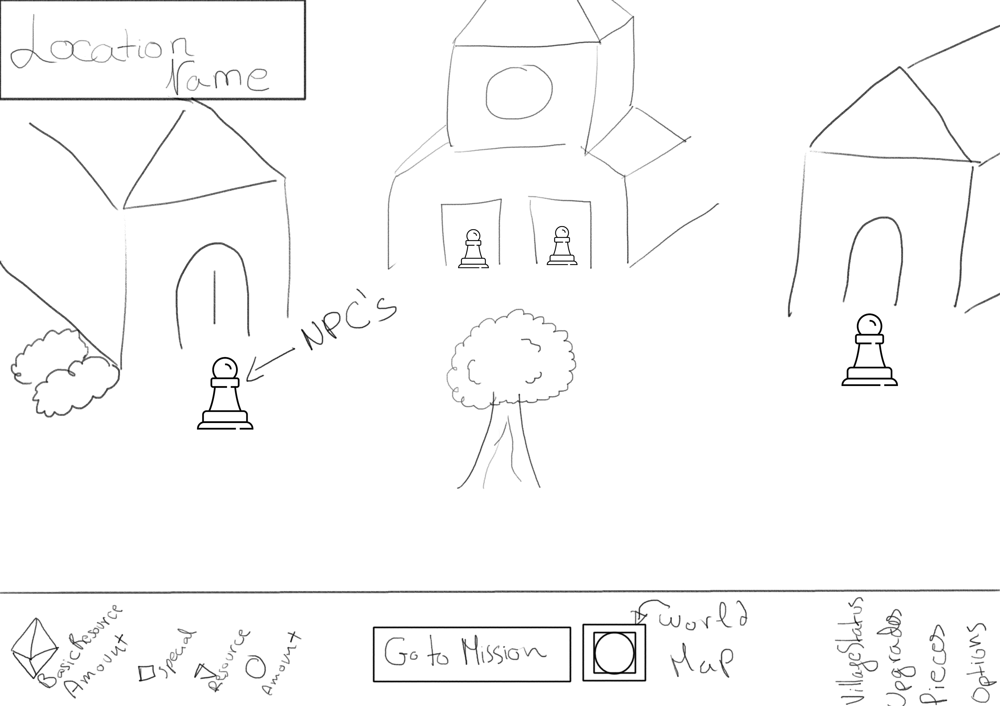
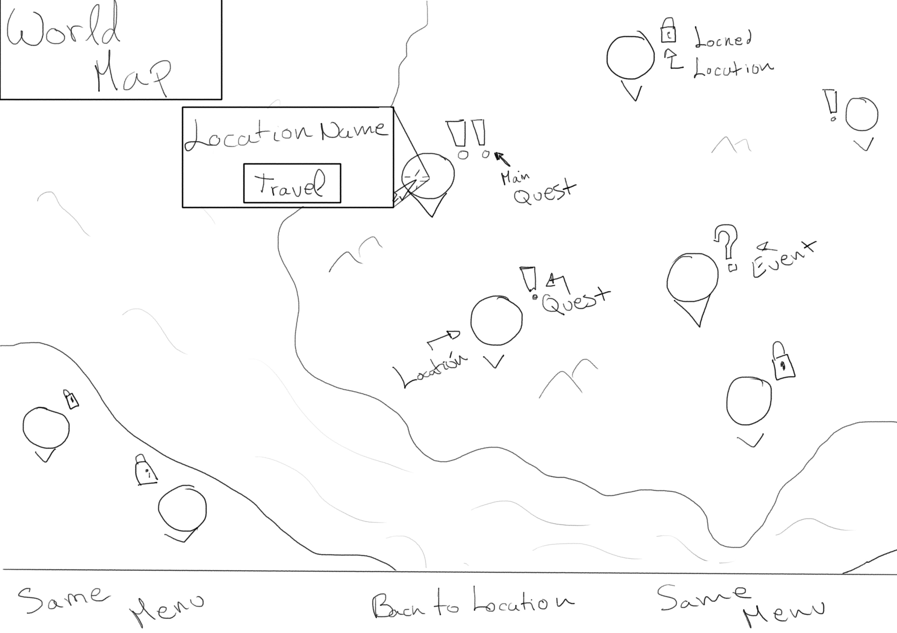
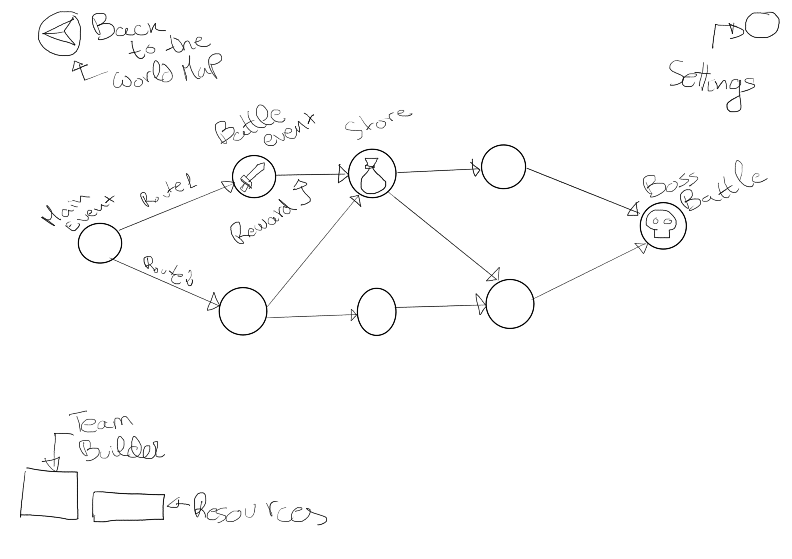
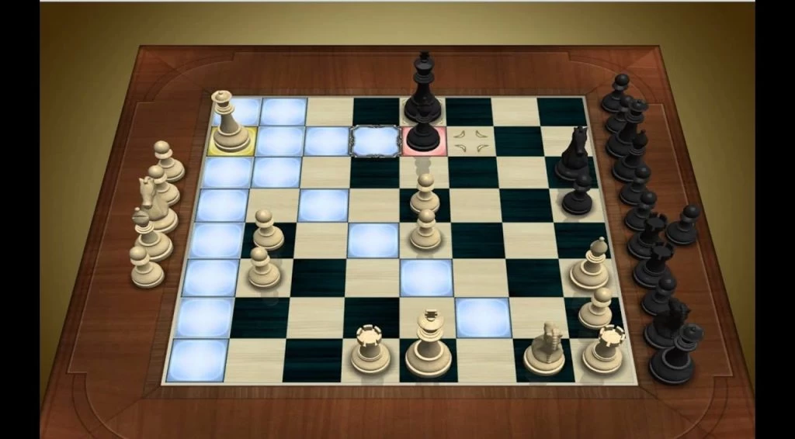

# 3.Descrición

### 1.Lore

Benvido as terras do xadrez, este é un mundo cruento no cal deberás loitar para **liberár á tua familia do xugo dun rei tirano** o cal, corrupto polo poder da inmortalidade perdeu de vista o valor das vidas humanas. En cada xeración un membro da familia é escollido pola **caixa de xadrez da familia**, terás que cargar con esta responsabilidade para ascender na con cada duelo de xadrez que gañas hasta poder plantarlle cara ao rei.

### 2.Bucle de xogo

Comenzarás na tua casa coas tuas **pezas iniciais**, nesta zona poderás falar con varios membros da tua familia (NPCs) que serán os encargados de **suministrar misións** coas que poderás desbloquear novas pezas, localizacións e conseguir recursos cos cales poderás **desbloquear melloras permanentes** para os mercaderes.
**Os mercaderes**, por un precio, venderán todo tipo de beneficios e **vantaxes que che axudarán na tua aventura**.

A medida que viaxes, loites e **completes as misións** de cada lugar irás **desbloqueando novas pezas e melloras para as tuas pezas actuales**. O xogo acaba cando consigues **chegar a xunta o rei e vencelo**, ou cando **matan ao teu Rei**. Si matan o teu Rei o teu personaxe actual morrerá, pero o que fai tan especial **o teu Rei é que ten o poder de legar unha das fichas temporales como ficha inicial da seguinte xeración**. 

Comenzarás ca seguinte xeración con unha peza adicional que che dará ventaxa para avanzar máis e mais rápido.

### 3.Mapa do mundo

Para cambiar de localización terás que ir ao botón de **Mapamundi** na pantalla de localización, a partir do cal se mostrará unha vista de todas as localizacións marcando si están ou non bloqueadas e si hai algún evento ou misión nas mismas. Ao interactuar con unha delas mostrarase unha descripción máis detallada.

### 4.Misións

As misións consistirán en unha serie de eventos enlazados os uns cos outros mediante **rutas** que poderás escoller a medida que avanzas. Ao interactuar con un dos eventos poderás ver unha descripción do mesmo para que poidas decidir que ruta se axeita máis ao teu obxectivo. A misión rematará unha vez completes o evento final que, polo xeral, consistirá en un *Boss*. Ou cando maten ao teu rei será o fin da misión e da xeración.

### 5.Combate

O combate desenvolverase do mesmo xeito que **unha partida de xadréz**, en cada turno cada xogador move unha peza e gaña o primeiro en **matar o Rei inimigo.** Ao interactuar con unha das pezas no teu turno amosarase unha vista dos movementos que pode facer, e ao seleccionar un lugar dispoñible realizarase a acción axeitada. De un xeito semellante a *Chess Titans*.

A diferencia do xadrez clásico non solo existen as pezas ás que estamos acostumados, se non que hai moitas mais, engadido a esto tamén cabe destacar que o taboleiro non será sempre igual, cambiará de forma tamaño e color según o duelo que se esté a realizar, incluindo tamén casillas especiales nas que non poidas moverte si non podes voar, ou que maten a tua peza si estás máis de un turno nela, por exemplo.

Poderás **escoller a formación que utilizarás en cada combate**, pero sempre terás que ter **obligatoriamente un Rei**.
