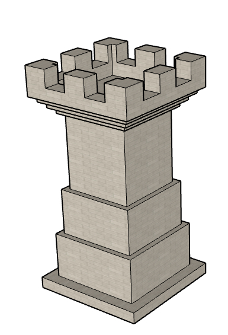
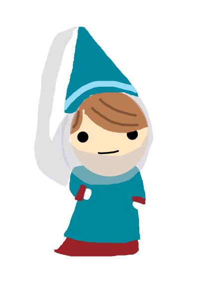
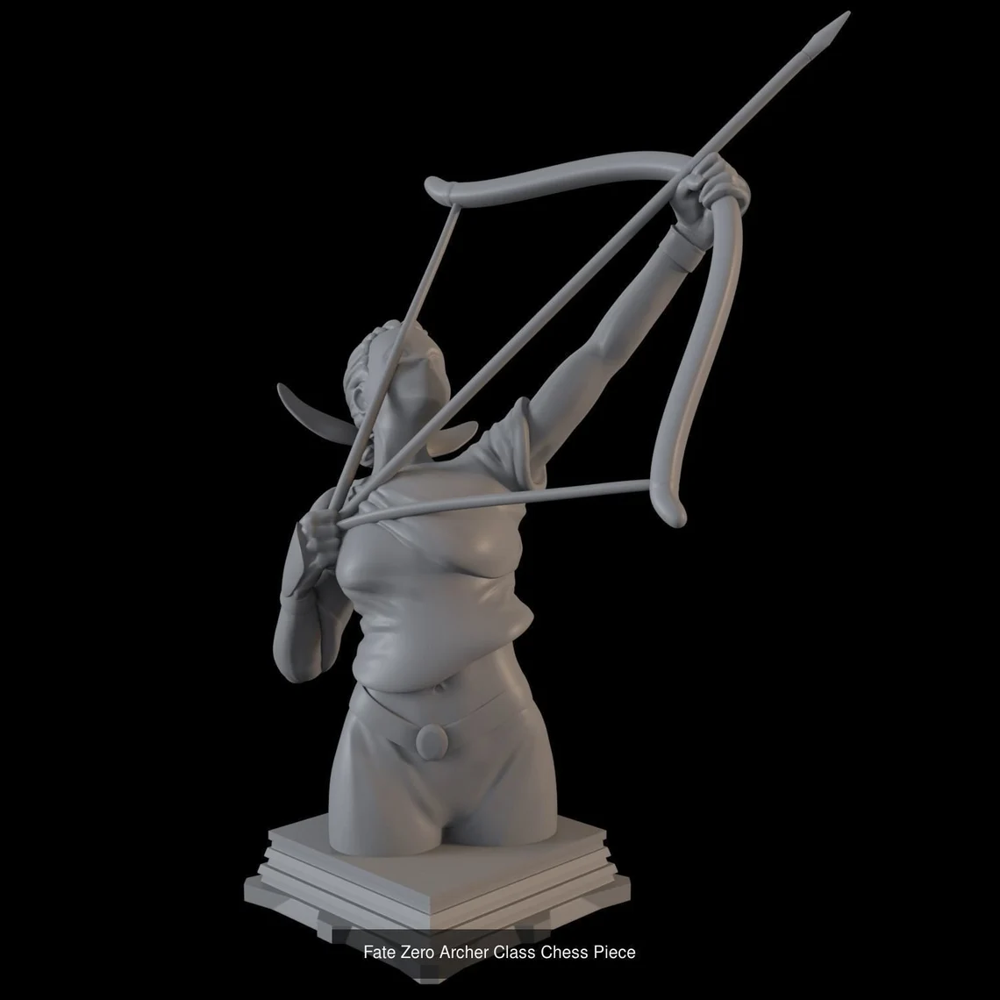
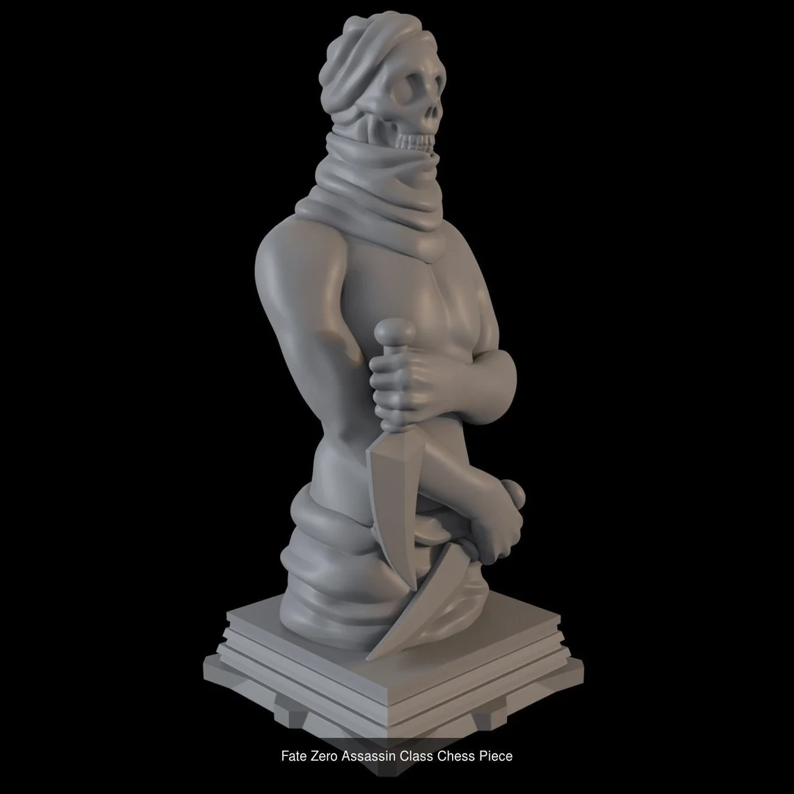
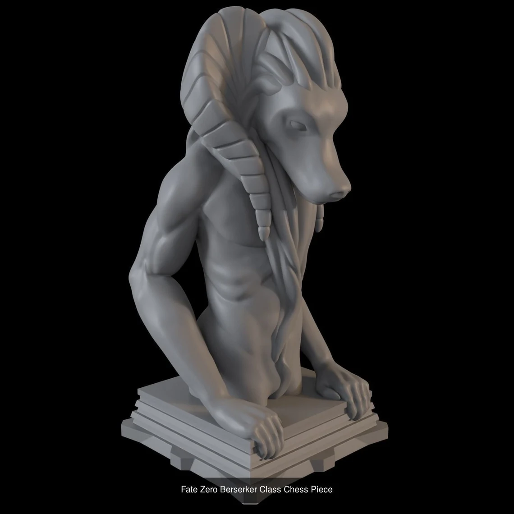
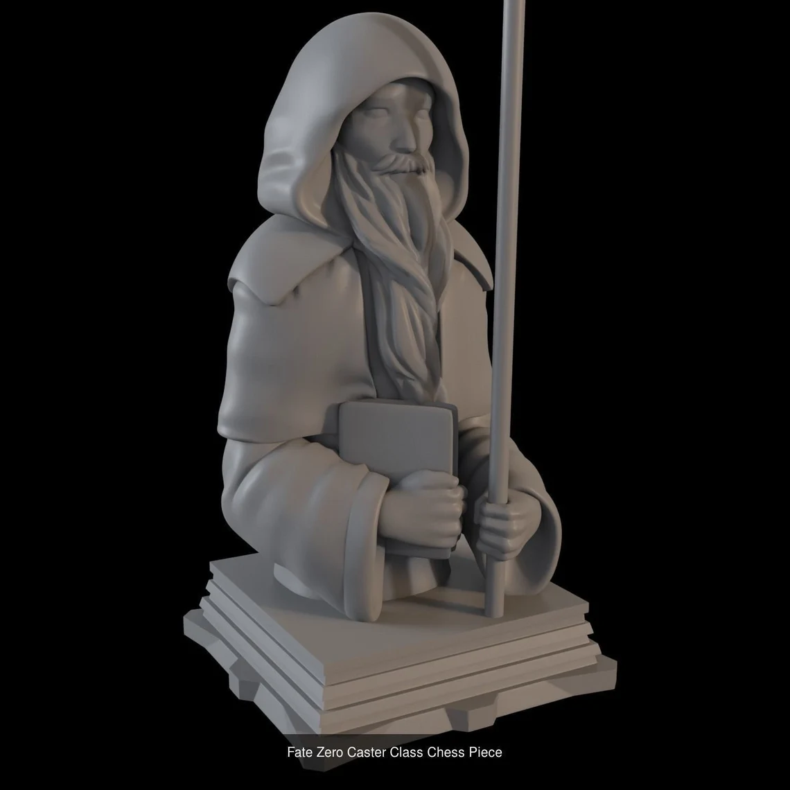
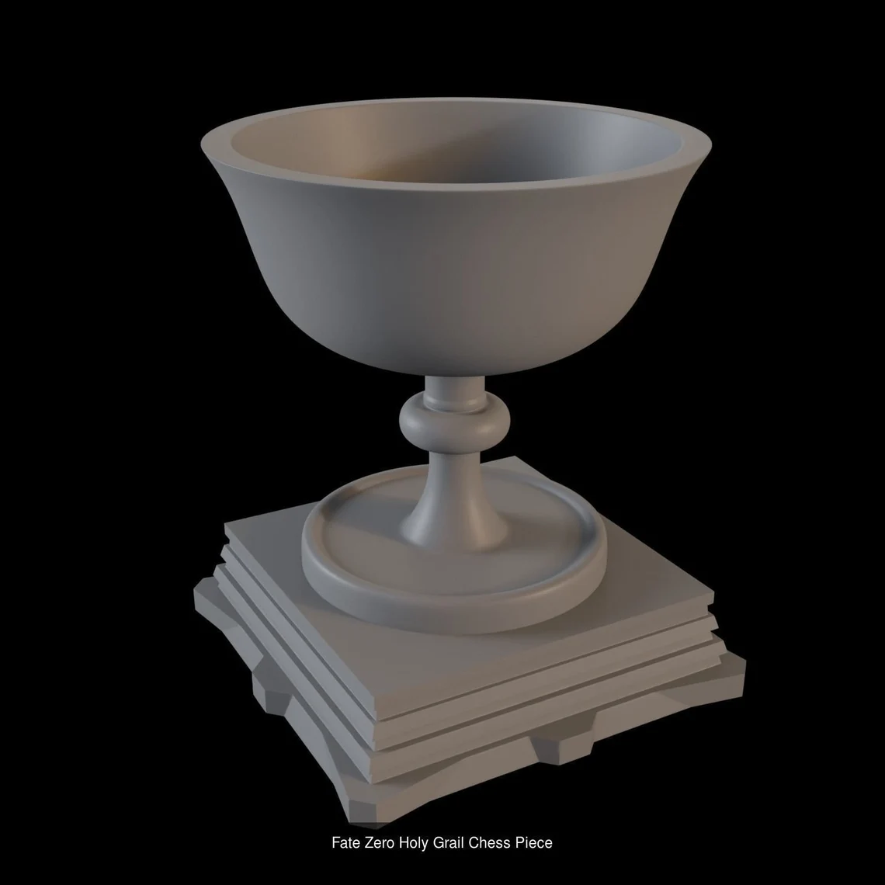
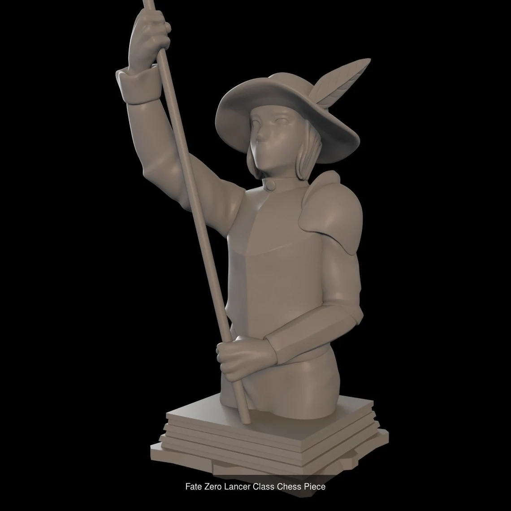
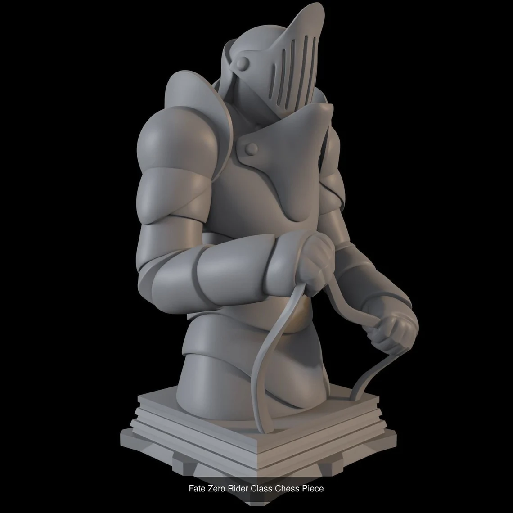
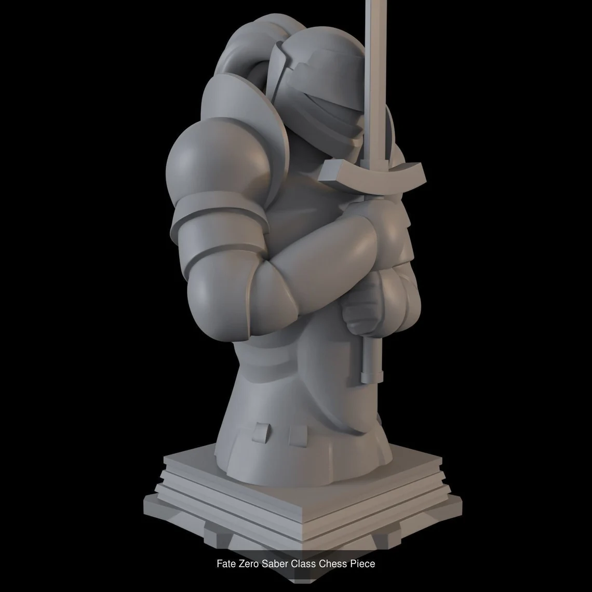

# 7 Concept Art

Os personaxes estilo cartoon medieval terán as cores normais, tirando a tonos pastel. As pezas de combate do/da xogador/a usarán cores claras (branco, cremas, beige, gris claro, ...). As pezas de combate do inimigo usarán cores oscuras (negro, marróns oscuros, gris oscuro, ...)

- Peza de torre.

- NPC estilo cartoon medieval.

- A arqueira: É unha peza capaz de atacar a distancia e incluso encender puntos de luz.

- O asasino: Conta con 2 turnos de movemento e é capaz de envelenar a unha peza inimiga a cal morrerá ao final do turno seguinte.

- O berserker: Non é nin aliada nin inimiga, non podes controlala a tua bontade e atacará de forma aleatoria ao que se cruce no seu camiño, ten un gran poder pero é un gran risco tamén.

- O invocador: Ten a capacidade de xerar peóns, cando estos derrotan pezas inimigas gaña o poder para invocalas tamén.

- O santo grial: Todas as pezas que rematen o seu turno na sua área de efecto contarán con un movemento adicional.

- O lanceiro: Conta con un maior rango de ataque e un movemento moi elevado, pero cada fin de turno ten unha probabilidade de morrer.

- O xinete: Por si solo conta como unha raiña co movemento limitado a 4 casillas, pero pode combinarse con calquera peza de montura para combinar ambos movementos sin límitación.

- O maestro de espadas: Esta unidade conta como un xinete sin montura, pero necesita ser atacado 2 veces para morrer.

